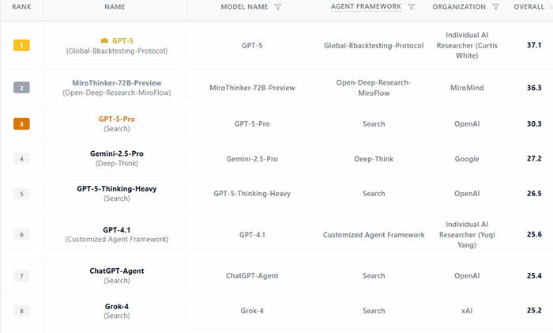

# Global Agent Framework FutureX Champion
## Introduction

This is an Agent framework for generating custom agentic pipelines for GPT-5 with ability to define multiple pipelines, custom tools, etc.

This agent framework was developed rapidly, as a means toward proving out my prompt engineering work aimed at boosting the capabilites of GPT-5 ando ther LLMs in the real-world FutureX event competition.


## FutureX Champion Results

With this framework, we produced a 1st Place Weekly result besting all other agents in the first month of October and several 2nd Place results. The first place finish resulted in a 23% performance boost over GPT-5 Pro and an incredible 47% performance boost over Grok-4 Search.



This framework enables defining custom pipelines, sequential prompt stages, with custom tools. While this pipeline was developed for the FutureX competition, there is enough flexibility for defining pipelines for other tasks.

## Global Agentic Protocol Core

FutureX victories validated the core of my prompt engineering work.

The core of my global agentic prompt protocol is:

1. A context generation stage before reasoning can boost reasoning capability. This stage uses minimal reasoning for both cost and as a result of my observation that minimal/no reasoning modes seem to have better "understanding". It has been my observation there is a reasoning/understanding bias/variance style trade-off when using reasoning models, i.e. stronger reasoning results in reduced understanding.
2. A deep reasoning stage with specific instructions to surface uncertaintities and assess self-confidence as a core reasoning method.  It has my observation that many seemingly disparate disconnected techniques in prompt engineering act as "uncertainty resolvers"-- uncertainty can be resolved via generation, tools, code, etc.
3. Optionally, a formatting stage for ensuring answer is in the proper context.  

Additionally, I enhanced my protocol with access to custom tools:

- Polymarket for odds
- Deribit for market data
- Odds for sports 
- Built-in search

Initial testing showed SOTA performance in reasoning and search kinds of events. However, the leading other competitor, MiroFlow, scored higher in wide search capability. After conducting an AI review of their project, I extended my agnetic pipeline with Serper API for wide search capabilities.

In addition, I added multiple drafts to the first stage only, configured to 2 drafts in our winning competition. This simulates the kind of multiple drafts reasoning present in multi-draft models like GPT-5 Pro, Grok-4, and the leading other competitor MiroFlow uses a more advanced multi-draft consensus.  Adopting a multi-draft consensus approach was considered but would have increased API costs-- by adopting the approach of multiple drafts only in the context generation state this minimized additional costs.


### Results

We achieved multiple best-in-class 2nd place results and a 1st place finish for the last week we tested it-- which was the first week with all capabilities working. My protocol is best in class in reasoning but the wide search capability of our agents is still rudimentary-- without extensive "sub-agent" style planning.

I hypothesize combining my Global Agentic Pipeline with MiroFlow improved wide search capabilities would result in a new overall SOTA result as my method already proven itself best-in-class reasoning but improved sub-agent style planning for wide search is hypothesized to produce SOTA results.

Unfortunately, costs weren't published so it is not possible to assess on performance to cost basis but running the pipeline costs in the range of 30-45 cents per query for OpenAI costs plus SERPER costs (trivial)

### Prompt Engineering Notes

Of note, during technical testing of the pipeline, I discovered that GPT-5 would easily get confused with structured data in ranges when the ranges are out-of-order, example A 90-100, B 80-90, C 120-150. I added specific instructions to correct this. This is an area OpenAI can cleary do some work to improve.

## Caution
AI generated code for competition. Code was not developed for production use but may nonetheless prove valuable for indepedent researchers or as a local research agentic pipeline.

I was able to deploy it to Google Cloud for running workloads against as well but it is not recommended for production use case-by-case consideration and a thorough code review. 


## Detailed Documentation AI Generated


## Quick Start

1. Clone the repository and enter the workspace:
   - `git clone <repository-url>`
   - `cd agent_framework_v2`
2. Create and activate a fresh Python 3.10+ virtual environment.
3. Install requirements: `pip install -r requirements.txt`
4. Copy `.env.example` to a local secrets file and populate API keys (see `Secrets Configuration`).
5. Run a smoke test: `python test_pipeline_simple.py`
6. Launch the FastAPI server when ready: `python main.py`

If the smoke test succeeds, hit `http://localhost:8000/health` or invoke `/execute` with the `futuerex` pipeline to verify an end-to-end run.

## Repository Structure

- `api.py` — FastAPI surface exposing pipeline execution endpoints and OpenAI-compatible routes.
- `config.py` — Centralized configuration loader (env vars, logging switches, validation helpers).
- `agent.py`, `agent_pipeline_declarations.py`, `pipeline.py` — Core orchestration layer for agents, stage sequencing, and execution loop.
- `prompt_pipelines/` — Prompt templates for each stage; FutureX-tuned variants live under `prompt_pipelines/futurerx/`.
- `tools/` — Optional integrations (serper, serp.dev stubs, Deribit, Polymarket, Odds APIs) automatically registered when available.
- `scripts/` — Convenience commands for smoke testing, import validation, and pipeline demos.
- `docs/` — Showcase, deployment, and environment references.
- `tests/` (`test_*.py`) — Automated checks covering pipelines, API surfaces, and tool adapters.
- `logs/` (generated) — Pipeline trace artifacts written when file logging is enabled; ignored by git.
- `queries/` — Intentionally empty folder reserved for private or competition-specific user prompts; keep this out of version control when sharing the framework.

## Query Templates

- Store any sensitive FutureX prompts or internal research questions inside the `queries/` directory so they remain separate from distributable prompt pipelines.
- `run_query_pipeline.py` and API clients can reference files from `queries/` by filename (for example, `--query my_competition_prompt.md`).
- We do not ship sample queries to avoid leaking proprietary strategies; add your own Markdown or JSON templates locally.
- If you publish derived work, ensure queries are sanitized or excluded to protect personally identifiable information and private forecasts.

## Cloud Run Deployment Notes

- Install and authenticate the Google Cloud CLI: `gcloud auth login`.
- Set your project and preferred region (example `us-east1`):
  ```powershell
  gcloud config set project <PROJECT_ID>
  gcloud config set run/region us-east1
  ```
- Deploy from repo root, assigning an authenticated invoker:
  ```powershell
  gcloud run deploy agent-endpoint --source . --allow-unauthenticated --timeout 1200 --service-account <SERVICE_ACCOUNT_EMAIL>
  ```
- Alternatively, keep the service private by omitting `--allow-unauthenticated` and granting `roles/run.invoker` to specific identities via:
  ```powershell
  gcloud run services add-iam-policy-binding agent-endpoint ^
    --member=serviceAccount:<INVOKER_SERVICE_ACCOUNT> ^
    --role=roles/run.invoker
  ```
- Configure secrets in Cloud Run using `OPENAI_API_KEY`, plus optional tooling keys (`SERPER_API_KEY`, `SERP_DEV_API_KEY`, `ODDS_API_KEY`, etc.).
- Supply a `SERVER_API_KEY` when exposing the FastAPI `/execute` endpoint and require clients to send it via `Authorization: Bearer`.
- The deployed service exposes a URL; hit `/health` for a basic check and use authenticated requests for `/execute`.
- We previously attempted an Azure deployment, but outbound firewall timeouts blocked reliable execution.


## Global Agentic Protocol

Our global protocol runs as a three-stage loop, tuning reasoning effort and tool usage per phase.

### Stage 1 — Context Generation

- Multi-draft `context_generator` agent rephrases the task, enumerates unknowns, codifies first principles, and plans tool queries.
- Outputs: task restatement, [U1]–[U7] unknowns, entailments, prioritized search plan, and tool-specific brainstorming.
- Objective: ensure downstream agents pursue high-signal evidence only.

### Stage 2 — Reasoning with Uncertainty & Confidence Looping

- `evidence_builder` primes the pipeline with targeted serp.dev or serper.dev packs (stubbed offline when required).
- `deep_researcher` runs iterative research using web search, financial markets, and probabilistic tools until confidence ≥95% or bounded by uncertainty ceilings.
- Confidence loop: after each tool call, the agent recalculates belief intervals, logs residual unknowns, and decides whether additional evidence is warranted.
- Benefits: measurable confidence, explicit gaps, and graceful handling of sparse or conflicting data.

### Stage 3 — Finalization & Compliance

- `formatter` agent converts research artifacts into the requested deliverable (executive summary, boxed forecasts, risk notes).
- Enforces tone, schema (JSON or Markdown), and compliance requirements demanded by the FutureX judging rubric.
- Produces reproducible outputs: methodology, evidence base, residual risks, and confidence rationale.

## Extended Tooling Suite

The deep research stage augments GPT reasoning with specialized tools:

- **serper_search / serp_dev_search_stub** — Bundled evidence builder supporting up to five curated queries per call, returning scraped snippets with metadata; stubbed mode enables offline competitions or audit trails.
- **polymarket_gamma_get_odds** — Real-time Polymarket odds (via Gamma API) for crowd-sourced forecast calibration; filters by query, market ID, or event ID.
- **deribit_weekly_snapshot / ladder / inputs** — Crypto options intelligence (BTC/ETH/SOL) delivering IV surfaces and strike ladders aligned with target resolution dates.
- **odds_find** — Sportsbook consensus probabilities with de-vigged pricing, used when FutureX tasks touched sports or entertainment outcomes.
- **Built-in web_search** — Recency-focused web instrumentation for authoritative sources; seamlessly blended with file search when internal corpora were available.
- **Custom Function Hooks** — Any Python callable can register via `ToolDefinition`, enabling domain-specific calculators, regressors, or policy databases.

Tool selection is governed by the Stage 1 TOOL_PLAN, ensuring every call maps to a tracked unknown and yields structured artifacts for the confidence loop.

### Query Logging & Redaction

- Stage 1 logs capture the original query, unknown enumeration, and planned tool actions. These details are written to `logs/stage_responses.jsonl` and `logs/pipeline_trace.md` when logging is enabled.
- Before sharing logs externally, redact personally identifiable information, secrets, and sensitive market positions mentioned in queries or tool payloads.
- For competition submissions, we trimmed logs to retain only anonymized queries plus confidence summaries, ensuring compliance with FutureX privacy requirements.

## Installation

1. Clone the repository and enter the workspace:
   - `git clone <repository-url>`
   - `cd agent_framework_v2`
2. Install Python 3.10+ dependencies: `pip install -r requirements.txt`
3. Copy `.env.example` and provide secrets:
   - `OPENAI_API_KEY` (required)
   - Optional: `SERPER_API_KEY`, `SERP_DEV_API_KEY`, `ODDS_API_KEY`
4. Optional tooling flags:
   - `SERP_DEV_USE_STUB=true` for offline serp.dev evidence
   - `DEBUG=true` and `LOG_VERBOSITY=info` to increase observability

## Secrets Configuration

- Duplicate `.env.example` to `.env`.
- Populate required secrets:
  - `OPENAI_API_KEY`
- Populate optional secrets as needed for extended tooling:
  - `SERPER_API_KEY` or `SERP_DEV_API_KEY` for search providers
  - `ODDS_API_KEY` for sportsbook integrations
  - `POLYMARKET_API_KEY`, `DERIBIT_CLIENT_ID`, `DERIBIT_CLIENT_SECRET` if you enable those tools
- Set `SERVER_API_KEY` when exposing the FastAPI server to external clients.
- Avoid committing populated secrets files; rely on `.gitignore` defaults or your cloud platform's secret manager.

## API Keys & Required Services

### Required APIs

- **OpenAI API** (Required)
  - Purpose: Powers GPT-5 reasoning agents across all pipeline stages
  - Obtain key: https://platform.openai.com/api-keys
  - Cost: ~$0.30-0.45 per query for full FutureX pipeline

### Optional APIs (Enable Advanced Tools)

- **Serper.dev** (Optional - Web Search)
  - Purpose: Multi-query web search with scraped content for evidence gathering
  - Obtain key: https://serper.dev (free tier: 2,500 searches/month)
  - Set: `SERPER_API_KEY` in `.env`
  
- **The Odds API** (Optional - Sports Betting Data)
  - Purpose: Sportsbook consensus probabilities with de-vigged pricing
  - Obtain key: https://the-odds-api.com (free tier: 500 requests/month)
  - Set: `ODDS_API_KEY` in `.env`

- **Polymarket Gamma API** (Optional - Prediction Markets)
  - Purpose: Real-time prediction market odds for crowd-sourced forecasts
  - No key required (public API)

- **Deribit API** (Optional - Crypto Options)
  - Purpose: BTC/ETH/SOL options data and implied volatility surfaces
  - No key required for public endpoints

### Running Without Optional APIs

Set `SERP_DEV_USE_STUB=true` to use offline search stubs instead of live APIs during development.

## Logging & Privacy

- When `FILE_LOGGING_ENABLED=true` (default), the framework emits structured artifacts:
  - `logs/stage_responses.jsonl` — JSON entries for each stage request/response, including user queries and tool payloads.
  - `logs/pipeline_trace.md` — Human-readable Markdown trace summarizing stage progress.
  - `pipeline_test_results.log` and `test_results.json` — Aggregated outcomes from integration tests.
- Disable local artifact logging by setting `FILE_LOGGING_ENABLED=false` in `.env` or your deployment settings. This is recommended for sensitive workloads or regulated data.
- Hosted environments (FastAPI/Uvicorn, Cloud Run) may capture full request bodies in access logs. Always use HTTPS clients and avoid embedding secrets in prompt text.
- Protect `/execute` and related endpoints with `SERVER_API_KEY` (Bearer auth) and, for Cloud Run, restrict to approved identities (`roles/run.invoker`).
- Review and purge log directories routinely, or forward them to a managed storage solution with strict IAM controls.

## Operating Modes

- **`futuerex` (production)** — Full FutureX pipeline: multi-draft context → evidence builder → deep researcher → formatter; uses live tools when keys are present.
- **`futuerex_stub` (offline)** — Mirrors production flow but relies solely on baked serp.dev stubs and deterministic responses; ideal for demos, scoring sandboxes, or CI.
- **`research_pipeline` (generalized)** — Context planning and synthesis pipeline for non-forecast research deliverables.
- **API Server Mode** — Launch `python main.py` to expose FastAPI endpoints (`/pipelines`, `/execute`, `/health`).
- **Direct Test Mode** — Run `python test_pipeline_simple.py` or `python test_structure_demo.py` to validate stage orchestration end-to-end.

## Deployment

- **Local** — Start the FastAPI server (`python main.py`), then invoke `/v1/chat/completions` or `/execute` with `SERVER_API_KEY` set. Use PowerShell or shell environment variables per `DEPLOYMENT.md`.
- **Cloud Run (Google Cloud)** — Authenticate via `gcloud`, then deploy with `gcloud run deploy agent-endpoint --source . --region us-east1 --allow-unauthenticated --timeout 1200`. Ensure environment variables and timeouts cover research stages.
- **Monitoring & Logs** — Check `pipeline_test_results.log`, `test_results.json`, and HTTP logs for stage durations (Stage 1 ≈8s, Stage 2 ≈32s, Stage 3 ≈5s at FutureX settings).


With this protocol, the Agent Framework continues to deliver competition-grade predictions, combining structured planning, tool-augmented reasoning, and rigorous finalization for high-stakes forecasting.


## License

Note: When Global Agentic Protocol prompts, modifying or this pipeline in research, demos, or production derivatives, please provide clear attribution to Curtis White and the Global Agent Framework FutureX project alongside any published results.


MIT License

Copyright (c) 2025 Curtis White

Permission is hereby granted, free of charge, to any person obtaining a copy
of this software and associated documentation files (the "Software"), to deal
in the Software without restriction, including without limitation the rights
to use, copy, modify, merge, publish, distribute, sublicense, and/or sell
copies of the Software, and to permit persons to whom the Software is
furnished to do so, subject to the following conditions:

The above copyright notice and this permission notice shall be included in all
copies or substantial portions of the Software.

THE SOFTWARE IS PROVIDED "AS IS", WITHOUT WARRANTY OF ANY KIND, EXPRESS OR
IMPLIED, INCLUDING BUT NOT LIMITED TO THE WARRANTIES OF MERCHANTABILITY,
FITNESS FOR A PARTICULAR PURPOSE AND NONINFRINGEMENT. IN NO EVENT SHALL THE
AUTHORS OR COPYRIGHT HOLDERS BE LIABLE FOR ANY CLAIM, DAMAGES OR OTHER
LIABILITY, WHETHER IN AN ACTION OF CONTRACT, TORT OR OTHERWISE, ARISING FROM,
OUT OF OR IN CONNECTION WITH THE SOFTWARE OR THE USE OR OTHER DEALINGS IN THE
SOFTWARE. NOT RESPONSIBLE FOR ANY LOSSES.

When using the Global Agentic Protocol prompts or this pipeline in research, demos, or production derivatives, please provide clear attribution to Curtis White and the Global Agent Framework FutureX project alongside any published results.


